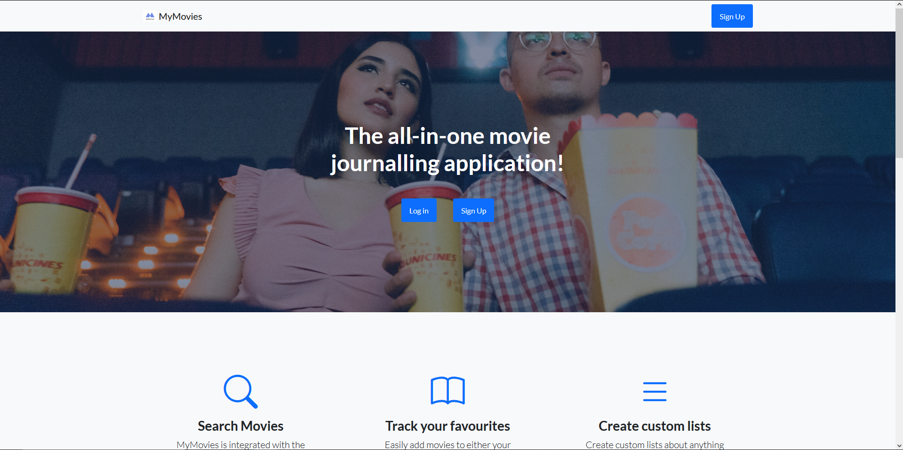
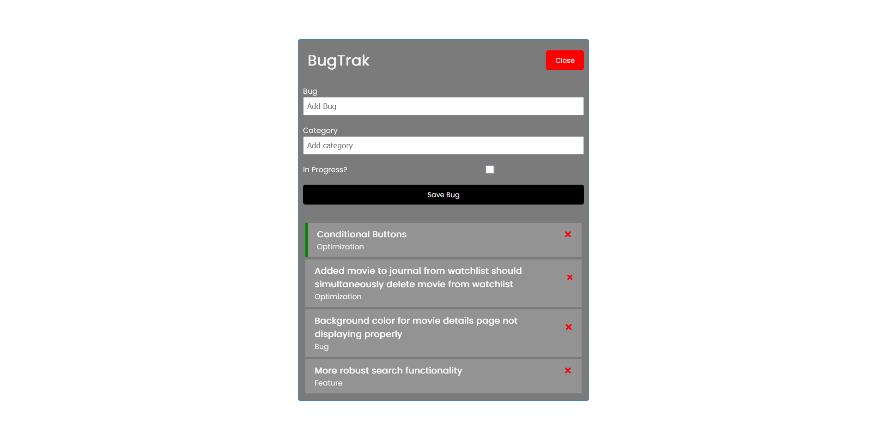

<h1 align="center">Hi , I'm Brandon</h1>
<h3 align="center">A full-stack web developer from Ontario</h3>

- 🔭 I’m currently working on [MyMovies](https://github.com/BBentleyDev/MyMovies)

- 🌱 I’m currently learning **Tailwind CSS**

- 👨‍💻 All of my projects are available at [https://brandonbentley.netlify.app](https://brandonbentley.netlify.app)

- 📫 How to reach me **bbentleydev@gmail.com**

<h3 align="left">Connect with me:</h3>

<h3 align="left">Languages and Tools:</h3>

             

<h2 align="center">Projects</h2>
<table bordercolor="#66b2b2">
  <tr>
   <td width="50%" valign="top">
      <h3 align="center">MyMovies</h3>
         
        
         
        

            
          
        

        
EJC, CSS, JS, MongoDB, Node, Express - A full-stack web application for movie journalling.

    </td>
       <td width="50%" valign="top">
      <h3 align="center">BugTrak</h3>
         
        
         
        

            
          
        

        
React, CSS, JS, MongoDB, Node, Express - A full-stack web application tracking issues and bugs while developing.

    </td>
  </tr>
  <tr>
    <td width="50%" valign="top">
      <h3 align="center">Mystique Salon</h3>
         
        
         
        

            
          
        

        
HTML, CSS and JS - A website design for an upscale salon.

    </td>
    <td width="50%" valign="top">
      <h3 align="center">Full Time Fitness</h3>
         
        
         
        
       
    
  
      

        
HTML, CSS and JS - A responsive landing page for a fitness center.

    </td>
  </tr>
  
<!--   <tr>
    <td width="50%" valign="top">
      <h3 align="center">Steve's Gallery</h3>
         
        
         
        

          
    
  
      

        
HTML, CSS and JS - A website design to showcase Steve Johnson's work from Pexel

    </td>
    <td width="50%" valign="top">
      <h3 align="center">Sally's Salon</h3>
         
      
         
        

          
  
  
      

        
HTML, CSS and JS - A webpage to showcase Sally's work and their designs

    </td>
  </tr> -->
</table>

<h2 align="center">🔥 Streak Stats</h2>

